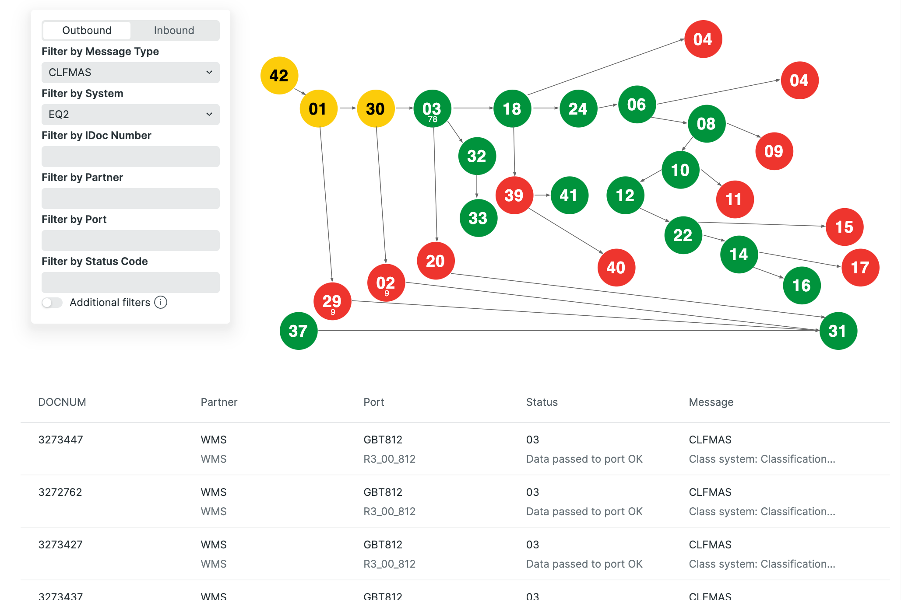
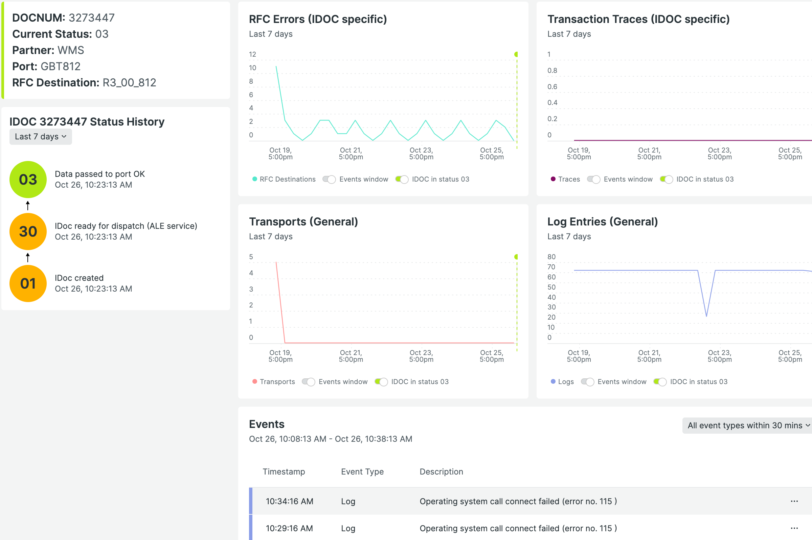

[](https://opensource.newrelic.com/oss-category/#new-relic-one-catalog-project)

# IDOC Explorer

  [](https://snyk.io/test/github/newrelic/nr1-sap-idocs)

SAP IDocs (Intermediate Documents) are standard containers for exchanging data between applications. When IDocs are processed through SAP systems, they go through a series of standard status. Each status represents a processing milestone or processing error for the IDoc. The IDOC Explorer helps the user to visualize the entire IDoc process and diagnose the root cause of the errors.

The IDOC Explorer can be accessed by going to the detail page or an IDOC entity. Here you have an overview of IDOCs with the specified time period. Quick filters are provider here to narrow the list to a specific business partner (e.g. vendor/customer, integrated systems, etc.) or specific status (e.g. Error transmitting to the partner port, etc.)  From here, users can double click on a specific IDOC to display the detail page. 



On the detail page, the user can see the attributes and the history of the status changes for this IDoc.  The Status change events are superimposed on the other related system events, such as RFC Errors, SAP Transaction Spans,  Transports and Log Entries. The details of these events are listed below and allow users to drill down further.



The IDoc Explorer requires the installation of the New Relic Monitoring for SAP Solutions on the monitored SAP systems.  Please refer to the [installation guide](https://drive.google.com/file/d/1ldVOF2Bo88nVBKn7ai1RIb7Sn6HhmFvI/view?usp=sharing) for more details. 

## Open source license

This project is distributed under the [Apache 2 license](LICENSE).

## Install using New Relic One Application Catalog

This application is primarily designed to be installed via the New Relic Application Catalog.

In [New Relic One](https://one.newrelic.com), navigate to your Apps section and click the IDOC Explorer application. The Manage Access button in the top right will let you choose the account where you want to make this app visible. It will be visible to all users of that account.

## Install using New Relic One CLI

IDOC Explorer is also an Open Source application. You can quickly and easily deploy it manually using the New Relic One CLI.

Ensure you have [git](https://git-scm.com/book/en/v2/Getting-Started-Installing-Git) and [npm](https://www.npmjs.com/get-npm) installed. If you're unsure whether you have them installed, run the following commands (they'll return version numbers if they're installed):

```bash
git --version
npm -v
```

Install the [New Relic One CLI](https://one.newrelic.com/launcher/developer-center.launcher). Follow the instructions to set up your New Relic development environment

```bash
git clone https://github.com/newrelic/nr1-sap-idocs.git
cd nr1-sap-idocs
npm install
nr1 nerdpack:uuid -gf
nr1 nerdpack:publish
nr1 nerdpack:subscribe  -C STABLE
```
This last command will subscribe the application to the account you've set as your default profile. You can check this using `nr1 profiles:default`. If you're not ready to deploy it to your account or want to test out changes you've made locally you can use:

```bash
git clone https://github.com/newrelic/nr1-sap-idocs.git
cd nr1-sap-idocs
npm install
** Make Any Desired Changes **
nr1 nerdpack:uuid -gf
nr1 nerdpack:serve
```

# Support

New Relic has open-sourced this project. This project is provided AS-IS WITHOUT WARRANTY OR DEDICATED SUPPORT. Issues and contributions should be reported to the project [here on GitHub](https://github.com/newrelic/nr1-sap-idocs/issues).

We encourage you to bring your experiences and questions to the [Explorers Hub](https://discuss.newrelic.com) where our community members collaborate on solutions and new ideas.

## Community

New Relic hosts and moderates an online forum where customers can interact with New Relic employees as well as other customers to get help and share best practices. Like all official New Relic open source projects, there's a related Community topic in the New Relic Explorers Hub. You can find this project's topic/threads here:

[https://discuss.newrelic.com/t/new-relic-monitoring-for-sap-solutions-now-available/188447](https://discuss.newrelic.com/t/new-relic-monitoring-for-sap-solutions-now-available/188447)

## Issues / enhancement requests

Issues and enhancement requests can be submitted in the [Issues tab of this repository](https://github.com/newrelic/nr1-sap-idocs/issues). Please search for and review the existing open issues before submitting a new issue.

## Security
This project adheres to the New Relic [security policy](https://github.com/newrelic/nr1-sap-idocs/security/policy).

# Contributing

Contributions are encouraged! If you submit an enhancement request, we'll invite you to contribute the change yourself. Please review our [Contributors Guide](CONTRIBUTING.md).

Keep in mind that when you submit your pull request, you'll need to sign the CLA via the click-through using CLA-Assistant. If you'd like to execute our corporate CLA, or if you have any questions, please drop us an email at opensource+nr1-sap-idocs@newrelic.com
